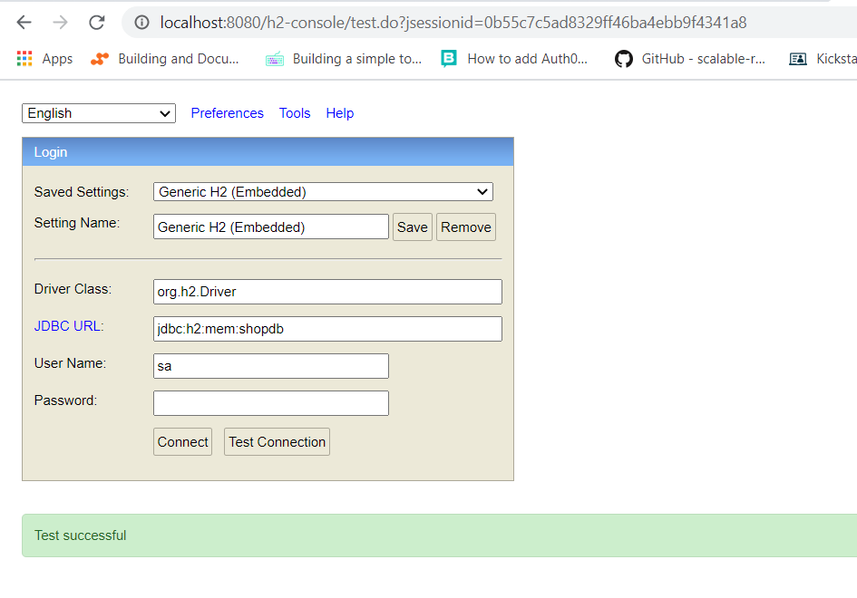

# Coding Challenge Project 


On a retail website, the following discounts apply:
1. If the user is an employee of the store, he gets a 30% discount
2. If the user is an affiliate of the store, he gets a 10% discount
3. If the user has been a customer for over 2 years, he gets a 5% discount.
4. For every $100 on the bill, there would be a $ 5 discount (e.g. for $ 990, you get $ 45 as a discount).
5. The percentage based discounts do not apply on groceries.
6. A user can get only one of the percentage based discounts on a bill.

### UML Class Diagram


### Involved Technologies

* maven
* spring boot
* H2 database
* lombok
* hibernate jpa
* jacoco
* spring mvc
* REST API
* swagger
* mockito 

### How to run the project?

* 1st solution: import the project into your workspace and run it as boot project
* 2nd solution: run the command 

```
mvn install a
```
  after that  in terminal windows run the following command
  
```
./mvnw spring-boot:run
```

* browse to [http://localhost:8080/](http://localhost:8080/)   to open the home page


### JACOCO Coverage Report 

To run the Test and Generate the coverage report, run the following Maven command. 

```
mvn clean test
```
To have an idea about the generated HTML report you can download  [jacoco report](./docs/jacoco/index.html) 


### Access and check H2 Database

H2 in memory database start automatically once the app starts and initiate "shop" schema;

* after starting the string boot app browse to [http://localhost:8080/h2-console/](http://localhost:8080/h2-console/) 

* use the following database configuration

```
Saved Settings:Generic H2 (Embedded)
Setting Name:Generic H2 (Embedded)
  
Driver Class:org.h2.Driver
JDBC URL:jdbc:h2:mem:shopdb
User Name:sa
Password:password
```




## Swagger UI

* Allows you to test the REST API via a user friendly interface


* Example of REST CALL : [http://localhost:8080/order/1]([http://localhost:8080/order/1)	
fetch the related Order from the database, including the related informations of USER, LINE ITEMS and PRODUCTS	

```
{
  "orderId": 1,
  "lineItems": [
    {
      "id": {
        "orderId": 1,
        "productId": 7
      },
      "product": {
        "productId": 7,
        "name": "Nutella",
        "unitPrice": 22.2,
        "productType": "GROCERIES"
      },
      "quantity": 1,
      "unitPrice": 22.2,
      "lineAmount": 22.2
    },
    {
      "id": {
        "orderId": 1,
        "productId": 1
      },
      "product": {
        "productId": 1,
        "name": "IPhone X",
        "unitPrice": 1099.99,
        "productType": "OTHERS"
      },
      "quantity": 1,
      "unitPrice": 1099.99,
      "lineAmount": 1099.99
    },
    {
      "id": {
        "orderId": 1,
        "productId": 8
      },
      "product": {
        "productId": 8,
        "name": "Mixed Nuts",
        "unitPrice": 15.25,
        "productType": "GROCERIES"
      },
      "quantity": 3,
      "unitPrice": 15.25,
      "lineAmount": 45.75
    },
    {
      "id": {
        "orderId": 1,
        "productId": 9
      },
      "product": {
        "productId": 9,
        "name": "Nescafe Gold",
        "unitPrice": 12.99,
        "productType": "GROCERIES"
      },
      "quantity": 2,
      "unitPrice": 12.99,
      "lineAmount": 25.98
    },
    {
      "id": {
        "orderId": 1,
        "productId": 2
      },
      "product": {
        "productId": 2,
        "name": "Flash Drive",
        "unitPrice": 25.5,
        "productType": "OTHERS"
      },
      "quantity": 2,
      "unitPrice": 25.5,
      "lineAmount": 51
    },
    {
      "id": {
        "orderId": 1,
        "productId": 3
      },
      "product": {
        "productId": 3,
        "name": "Webcam",
        "unitPrice": 29.99,
        "productType": "OTHERS"
      },
      "quantity": 1,
      "unitPrice": 29.99,
      "lineAmount": 29.99
    }
  ],
  "user": {
    "userId": 1,
    "userType": "AFFILIATE",
    "firstName": "Kamel",
    "lastName": "Haddad",
    "registrationDate": "2020-06-28T04:15:10.148+00:00"
  },
  "orderDate": "2020-06-28T04:15:10.157+00:00",
  "billed": true
}
```

* Example of REST CALL : [http://localhost:8080/order/2/bill](http://localhost:8080/order/2/bill)
Generate a BILL associated to the entered oderID, calculate the discounts and payable amount, insert the bill information and related discounts in the database and then mention the order as billed so for the next call the API just fetch the BILL from database

```
{
  "billId": 2,
  "order": {
    "orderId": 2,
    "lineItems": [
      {
        "id": {
          "orderId": 2,
          "productId": 3
        },
        "product": {
          "productId": 3,
          "name": "Webcam",
          "unitPrice": 29.99,
          "productType": "OTHERS"
        },
        "quantity": 1,
        "unitPrice": 29.99,
        "lineAmount": 29.99
      },
      {
        "id": {
          "orderId": 2,
          "productId": 2
        },
        "product": {
          "productId": 2,
          "name": "Flash Drive",
          "unitPrice": 25.5,
          "productType": "OTHERS"
        },
        "quantity": 2,
        "unitPrice": 25.5,
        "lineAmount": 51
      },
      {
        "id": {
          "orderId": 2,
          "productId": 4
        },
        "product": {
          "productId": 4,
          "name": "Laptop",
          "unitPrice": 762,
          "productType": "OTHERS"
        },
        "quantity": 1,
        "unitPrice": 762,
        "lineAmount": 762
      },
      {
        "id": {
          "orderId": 2,
          "productId": 9
        },
        "product": {
          "productId": 9,
          "name": "Nescafe Gold",
          "unitPrice": 12.99,
          "productType": "GROCERIES"
        },
        "quantity": 2,
        "unitPrice": 12.99,
        "lineAmount": 25.98
      },
      {
        "id": {
          "orderId": 2,
          "productId": 10
        },
        "product": {
          "productId": 10,
          "name": "Pringles Chips",
          "unitPrice": 8.4,
          "productType": "GROCERIES"
        },
        "quantity": 4,
        "unitPrice": 8.4,
        "lineAmount": 33.6
      },
      {
        "id": {
          "orderId": 2,
          "productId": 8
        },
        "product": {
          "productId": 8,
          "name": "Mixed Nuts",
          "unitPrice": 15.25,
          "productType": "GROCERIES"
        },
        "quantity": 3,
        "unitPrice": 15.25,
        "lineAmount": 45.75
      }
    ],
    "user": {
      "userId": 2,
      "userType": "EMPLOYEE",
      "firstName": "Amer",
      "lastName": "Asha",
      "registrationDate": "2017-06-20T15:00:00.000+00:00"
    },
    "orderDate": "2020-06-28T04:15:10.157+00:00",
    "billed": true
  },
  "discounts": [
    {
      "discountId": 3,
      "description": "For every $100 on the bill, there is $5 discount",
      "discountAmount": 45
    },
    {
      "discountId": 4,
      "description": "EMPLOYEE has a discount of 30% on non-groceries items",
      "discountAmount": 252.9
    }
  ],
  "billingAddress": "dummy address",
  "shippingAddress": "dummy address",
  "totalDiscount": 297.9,
  "totalAmount": 948.32,
  "totalNonGroceriesAmount": 842.99,
  "payableAmount": 650.42
}
```


## Business Concept

